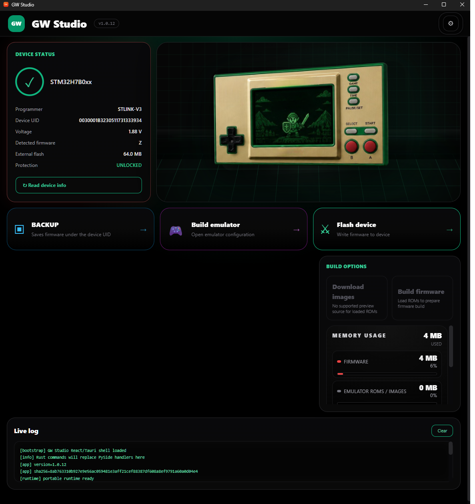
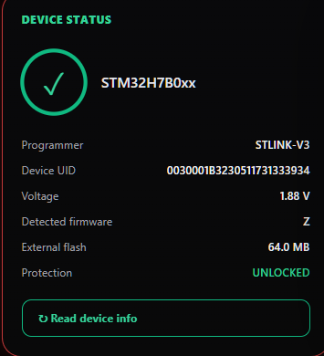
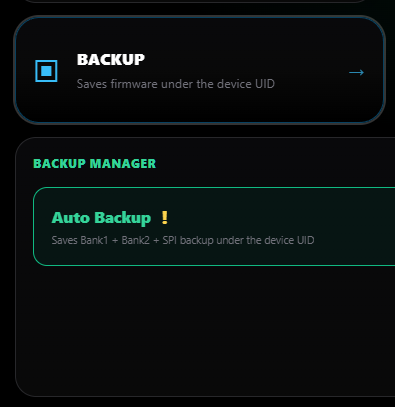
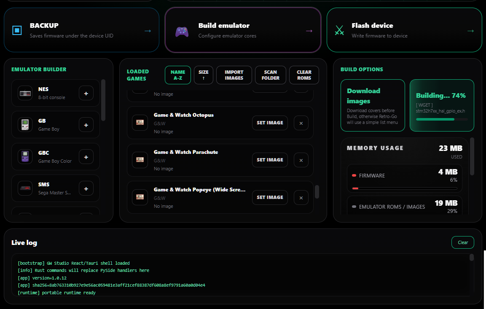
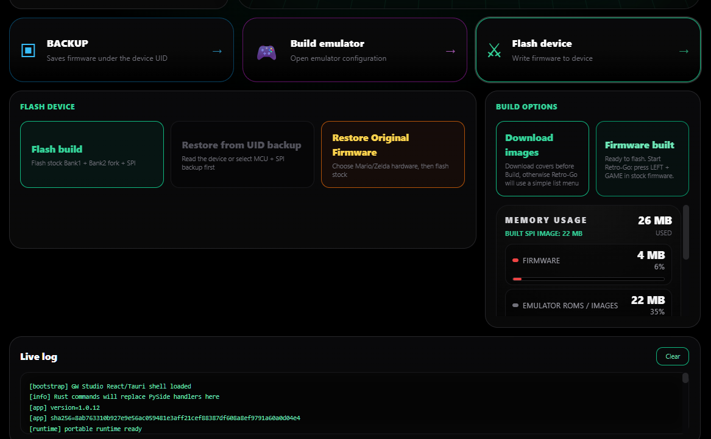
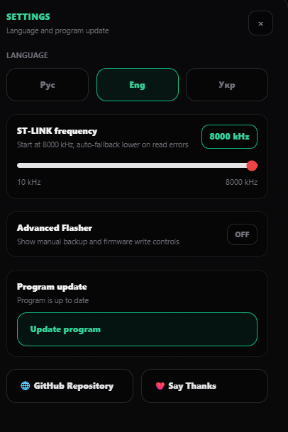

# GW Studio

GW Studio is a portable Windows application for Nintendo Game & Watch modding workflows.

Current release: `1.0.15`.

The program helps read console information, create backups, build a Retro-Go firmware bundle, flash the console, and restore firmware from user-owned backups or user-provided stock firmware.

## What It Does

- Reads Game & Watch hardware information through ST-LINK.
- Saves console backups under the device UID.
- Builds either a dual-boot setup or a Retro-Go-only single firmware.
- Supports offline firmware builds without connecting a programmer first.
- Shows memory usage between console status and the console preview for faster build checks.
- Lets offline users select STOCK, 4, 8, 16, 32, 64, 128, or 256 MB external SPI capacity.
- Exports the generated firmware folder for manual flashing through Raspberry Pi or another programmer.
- Imports supported ROMs for Retro-Go cores.
- Downloads optional game menu images from public thumbnail sources.
- Uses small 96x96 firmware images for the console while keeping UI previews separate.
- Flashes Bank1, optional Bank2, and SPI with progress indication after the console is identified.
- Restores the console from UID-based backups.
- Restores original stock firmware after the user provides matching stock files.
- Checks GitHub Releases for application updates.

## What Is Not Included

GW Studio does not include Nintendo firmware, commercial games, BIOS files, or copyrighted ROMs.

You must provide your own legally obtained:

- Game & Watch stock firmware backups.
- Game ROMs.
- BIOS files required by specific emulator cores, such as ColecoVision or MSX.

## Supported System

- Windows 10 or Windows 11 x64.
- ST-LINK compatible programmer for backup and flashing through GW Studio.
- Nintendo Game & Watch Mario or Zelda hardware.
- Folder path without Cyrillic characters.

The portable release is a single executable. On startup it extracts its bundled tools to a temporary runtime folder next to the exe and removes that runtime after closing.

## Screenshots

### Main Menu

The main screen shows device status, the selected or detected hardware profile, and the main workflow buttons. Build remains available without a connected console; Backup and Flash require device detection.



### Device Status

Read the connected console, ST-LINK programmer, UID, detected firmware, external flash, and protection state.



### Auto Backup

Save Bank1, Bank2, and SPI backups under the detected console UID before flashing.



### Build Emulator

Import ROMs, download optional menu images, and build the Retro-Go firmware bundle. Choose `M`, `Z`, or `NONE`; `NONE` creates a Retro-Go-only image and asks for the hardware profile.



### Flash Device

Flash the prepared Bank1, optional Bank2, and SPI images with progress indication. The firmware output folder can also be opened for manual Raspberry Pi flashing.



### Settings

Change language, update the application, and enable advanced flasher options when needed.



## Download And Verify

Download the latest `GWStudio.exe` from GitHub Releases:

```text
https://github.com/Serjio193/GWstudio/releases/latest
```

Each release also provides:

- `GWStudio.exe.sha256`
- `GWStudio.exe.sig`

PowerShell verification:

```powershell
Get-FileHash -Algorithm SHA256 .\GWStudio.exe
```

The printed hash must match the first value inside `GWStudio.exe.sha256`.

Example `.sha256` format:

```text
87664067AB929B6C55B53886B9D0D71887A27BFD09C1A2A85FF8DF8A64FA2B9D  GWStudio.exe
```

## Windows SmartScreen

GW Studio is currently not code-signed. Windows may show a warning such as "unknown publisher" or "Windows protected your PC".

This warning appears because the executable is unsigned and new, not because the SHA256 check failed. To reduce risk:

- Download only from the official GitHub Releases page.
- Verify `GWStudio.exe` with the matching `.sha256` file.
- Keep the exe in a Latin-only folder path, for example `C:\GWStudio\GWStudio.exe`.

## Basic Workflow

1. Start GW Studio.
2. Open `Build emulator` and add ROMs.
3. Choose the firmware layout:
   - `M` or `Z`: dual boot using matching user-provided stock firmware.
   - `NONE`: Retro-Go only; choose `M Hardware` or `Z Hardware`.
4. Optional: press `Download Images` before building if you want images in the Retro-Go menu.
5. Press `Build Firmware`.
6. If the console was not read, select the installed external SPI capacity: `STOCK`, `4`, `8`, `16`, `32`, `64`, `128`, or `256 MB`.
7. For manual Raspberry Pi flashing, open the generated firmware folder from `Flash Device`.
8. To flash through GW Studio, connect ST-LINK, press `Read Device Info`, create a backup, and use `Flash Build`.

Dual boot writes stock Bank1, Retro-Go Bank2, and SPI. Retro-Go-only mode writes Retro-Go Bank1 and SPI with `INTFLASH_BANK=1` and `EXTFLASH_OFFSET=0`.

If stock firmware files are required and missing, GW Studio asks you to drop the matching original files. The program checks that Mario/Zelda stock files match the selected hardware before saving them.

## Updates

GW Studio checks the latest GitHub Release after startup. If a newer version is found, it asks before updating.

The update process:

1. Downloads the new exe from GitHub Releases.
2. Requires the official `GWStudio.exe`, `GWStudio.exe.sha256`, and `GWStudio.exe.sig` release assets.
3. Verifies SHA256 before installing.
4. Verifies the Ed25519/OpenSSH signature with the public key built into the app.
5. Closes the current application.
6. Saves `GWStudio.exe.rollback` next to the current exe.
7. Replaces the old exe.
8. Starts the new version.

You can also run the same check from Settings with `Update program`.

## Links

- [Latest release](https://github.com/Serjio193/GWstudio/releases/latest)
- [Report an issue](https://github.com/Serjio193/GWstudio/issues)

## Support

<a href="https://paypal.me/SerhiiTarnopovych" target="_blank">
  
</a>
&nbsp;&nbsp;
<a href="#usdt-trc20">
  
</a>

<details id="usdt-trc20">
<summary>Show USDT (TRC20) wallet</summary>

`TB4kzsHL3emLtdvDroNE9dEpMhUW6r3bTL`

<br>


</details>

## Third-Party Components

GW Studio uses open-source third-party tools and firmware projects. See:

- `THIRD_PARTY_NOTICES.md`
- `THIRD_PARTY_TOOLS.md`
- `LICENSE_MANIFEST.md`
- `third_party_licenses/`

Retro-Go fork source:

- https://github.com/sylverb/game-and-watch-retro-go

Game & Watch patch source:

- https://github.com/BrianPugh/game-and-watch-patch
